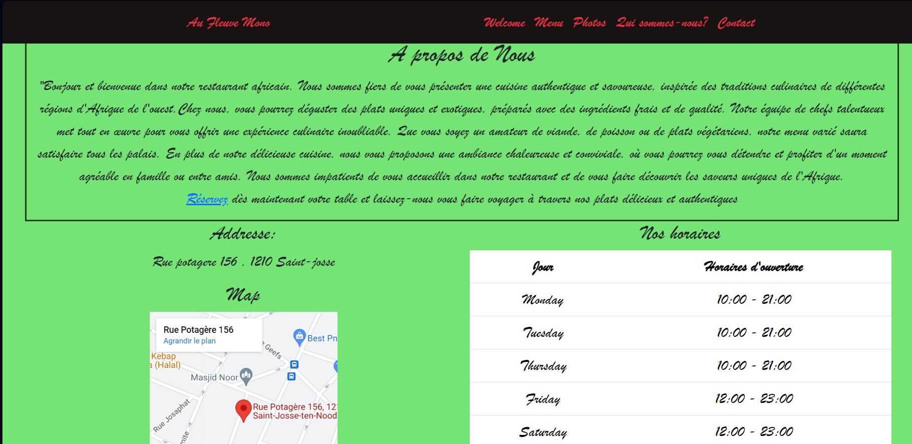

# Restaurant-css-framework 

Bienvenue Au Fleuve Mono

## Projet réalisé par Yves Bolong

 il s'agit d'un site web a propos de la franchise d'un restaurant.
Commencé le 03/10 à l'occosion d'un projet solo avec BeCode

Le lien vers mon restaurant [Au Fleuve Mono]  (https://yvessoham.github.io/restaurant-css-framework/)

## Technologies utilisées 

1. HTML5
2. CSS (quelques balises css dans le html)
3. Bootstrap 
4. Javascript (Pour faire fonctionner le formulaire et le GDPR)

## Fonctionnalités

- **Menu  :** Parcourez notre menu complet avec des images 

- **Contact :** Réservez une table en quelques clics avec notre formulaire de réservation simple et rapide.

- **Galerie de Photos :** Explorez notre galerie de photos pour voir nos plats et des descriptions détaillées de chaque plat. Avec une pagination pour aller vers toutes les grandes lignes du menu. Une page pour chaque entete du menu.

- **Qui sommes-nous :** Trouvez nos informations de contact, y compris notre adresse, numéro de téléphone et horaires d'ouverture.

